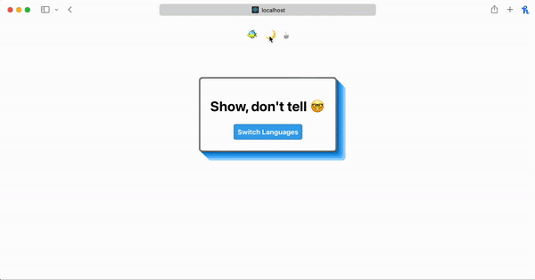

# React Starter ⚛️
Get to coding faster with my flavor 🍦 and structure  🏗️ of [react](https://reactjs.org/docs/getting-started.html). 




### Table Of Contents
- [Getting Started](#getting-started)
- [Internationalization](#internationalization)
- [Theming](#theming)
- [Technologies](#technologies)

# Getting Started
Fork the project to your repositories.
[About Forking Github](https://docs.github.com/en/get-started/quickstart/fork-a-repo)

Install dependencies
```zsh
yarn
```

# Internationalization
Make your application easy to translate and keep commonly used phrases and words in one place with internationalization with [react-i18next](https://react.i18next.com/getting-started).


**Important Files**
- Configuration: `src/i18next/index.js` 
- Translation Files: `src/i18next/locales`

The following is a breif overview how react-i18next is handling translations, what is being imported and how to make updates. Details can be found on the official documentation.

1. Add the theme provider and config to your application root in `index.js`.
```javascript
...
// configuration file
import i18n from './i18next/index';
// i18next provider
import { I18nextProvider } from 'react-i18next';

const container = document.getElementById('root');
const root = createRoot(container);
const app = (
  <StrictMode>
    {/* Apply config to provider */}
    <I18nextProvider i18n={i18n}>
      <App />
    </I18nextProvider>
  </StrictMode>
);
```
2. Inorder to hook into the translation files in any component inside `<App />` you need to use the `useTranslation` hook provided by react-i18next. The `t` translation function pulls in your word or phrase and updates according to the selected translation file. 
```javascript
{t('json.path.to.translated.string')}
```

```javascript
...
import { useTranslation } from 'react-i18next';
import { Card } from './components/index';

function App() {
  // accessor hook for the translation file
  const [t] = useTranslation();

  return (
    <div>
      <Card>
        <h1> 
          {/* grab json string */}
          {t('common.welcome')}
        </h1>
      </Card>
    </div>
  );
}

export default App;
```
3. There is a simple built in change language function that currently switches between Japanese and English. The `changeLanguage` function comes from i18next, which is a co-library to react-i18next, already installed: `App.jsx`.
```javascript
  const changeLng = () => {
    // Selecting a new language
    const lng = i18n.language === 'en' ? 'jp' : 'en';
    // Updating the document tag
    document.documentElement.lang = lng;
    // Built in switcher
    i18n.changeLanguage(lng)
      .catch((err) => {
        console.log('something went wrong loading', err);
      });
  };
```

# Theming and Customization
Customize your app's theme, single or multiple, with the `ThemeProvider` and `useTheme` hook making access, updating, and customizing your theme simple. 

**Important Files**
- Context & Hook: `src/contexts/themeContext.jsx`
- Provider Entry: `src/index.jsx`
- CSS Variables: `src/assets/_variables.scss`
- Theme, Dark, Coffee style files: `src/assets/_theme*.scss`
- Colors: `src/assets/_colors.scss` 
- Example: `src/App.jsx`

Full details on how React Contexts work can be found [here](https://reactjs.org/docs/context.html). This starter application makes a few assumptions in regards to naming and styles out of the box. 

**Assumptions**
1. The entry point, i.e. where the theme provider lives, is at the root of the application, wrapping the application. Placement can be adjusted. Components inside `<App />` have access to the `useTheme` hook.
```javascript
  ...
  <ThemeProvider>
      <App />
  </ThemeProvider>
```
2. The default theme is named `theme`. This can be found defined as a react state inside the `themeContext.jsx` file. 
```javascript
const [theme, setTheme] = useState('theme');
```
3. Two alternative themes are named `theme-dark` and `theme-coffee` and are set by importing the `useTheme` hook and associated `setTheme` function.
```javascript
...
import { useTheme } from './contexts/themeContext';

function SomeComponent() {

  // set theme function
  const { setTheme } = useTheme();

  return (
    <div className="some-component">
      <div>
        <button
          className="theme-button"
          type="button"
          onClick={() => setTheme('theme')}>🐠</button>
        <button
          className="theme-button"
          type="button"
          onClick={() => setTheme('theme-dark')}>🌙</button>
        <button
          className="theme-button"
          type="button"
          onClick={() => setTheme('theme-coffee')}>☕</button>
      </div>
    </div>
  );
}

export default SomeComponent;
```
4. The string value set via the `useTheme` hook applies the newly set `theme` value to a callName inside `App.jsx`. This class is at the root of the application and allows child components to inherit the newly select style sheet. 

```javascript
...
import { useTheme } from './contexts/themeContext';

function App() {
  const { theme } = useTheme();

  useEffect(() => {
    // Updating browser header color (i.e. safari)
    const schema = document.querySelector('meta[name="theme-color"]');
    const style = getComputedStyle(document.body.querySelector('.App'));
    // --app-bg-color is the css variable of the current theme
    const headerColor = style.getPropertyValue('--app-bg-color');
    // Set the theme color
    schema.setAttribute('content', headerColor);
  }, [theme]);

  return (
    // theme value applies the class, theme, theme-dark, or theme-coffee
    <div className={`App ${theme}`}>
      ...rest of application
    </div>
  );
}

export default App;
```
5. Themes are defined in the `assets/` folder by a `_theme*.scss` file. You can update, add or change these files. Each file is expecting their class inorder to activate which variables to pull in when a theme is switched. All variables are defined in a single file `_variables.scss`.
```scss
// Default Theme, theme class selector
.theme {
  --app-bg-color: #{$AppBgColor};
  --app-text-color: #{$TextColor};
  ...
}
```

```scss
// Theme Coffee, theme class selector
.theme-coffee {
  --app-bg-color: #{$CoffeeAppBgColor};
  --app-text-color: #{$CoffeeTextColor};
  ...
}
```

```scss
// Theme Dark, theme class selector
.theme-dark {
  --app-bg-color: #{$DarkAppBgColor};
  --app-text-color: #{$DarkTextColor};
  ...
}
```
Finally, the manor in which all themes, styles, and variables are imported to the application can be found in `src/App.scss`. Because we are importing the assets folders inside `App.scss` child components have access to all css `var()` variables.
```scss
@use 'assets' as *;

.App {
  color: var(--app-text-color);
  height: 100%;
  background-color: var(--app-bg-color);
  display: flex;
  flex-direction: column;
  align-items: center;
}
...
```


# Technologies

#### internationalization
- [react-i18next](https://react.i18next.com/getting-started)
- [i18next](https://www.i18next.com)
- [i18next-browser-languagedetector](https://react.i18next.com/legacy-v9/step-by-step-guide#c-auto-detect-the-user-language)
- [sass](https://sass-lang.com/)
- [icons](http://iconsax.io)


